ST558 - Project 1
================
Bryan Bittner
2022-06-24

-   [Financial Data Vignette](#financial-data-vignette)
-   [EDA](#eda)

# Financial Data Vignette

You might be asking yourself, what exactly is a vignette. Well let me
save you the hastle of a google search and answer that question here. A
vignette is defined as “a brief evocative description, account, or
episode”. Now you might ask yourself what evocative means. Rather then
get caught in an endless loop, let use an easier to understand
definition of a vignette. In this context a vignette is just a short,
informative guide for how to use and deploy a lookup on financial data.

This vignette will be centered around a call to an API. The API I chose
was created by Polygon.io and it is centered around financial data,
specifically stock prices. The advantage of using an API in code is that
we can customize function(s) and have them automatically run and
retrieve updated results. This beats manually going out to a website to
check the stock ticker.

One thing to note - I do not claim to be an investment planner or
anywhere close to an expert on stocks. Any suggestions represented here
are meant for general entertainment and interests. Do not heed any of my
advice for trading as you will for sure lose money!

Below is a list of packages that were used in the creation of this
vignette. The tidyverse package is a collection of commonly used
packages. The knitr package is used to knit the document. The httr and
jsonlite packages will be used to call an API an display the results.
The TTR package is lesser known r package used specifically for stock
related functions.

-   tidyverse
-   knitr
-   httr
-   jsonlite
-   TTR

In addition to the pre-built r packages, there are also a number of
functions that were created specifically for this vinette. Here is a
list of the functions and a brief description of what they do:

-   getSymbolByCompanyName() - Pass in the company name and returns its
    stocks symbol
-   isValidSymbol() - Pass in a stock symbol to make sure it is a valid
    symbol
-   isValidDate() - Pass in a date to make sure it is in the correct
    date format
-   stockDailyLookup() - Used to get the daily open, close and other
    related info for a specific day
-   stockAggregateLookup() - Used to get Aggregated Stock information
    with a number of different options
-   isValidTimespan() - Makes sure the timespan option used in the
    Aggregate Lookup is valid

The lookups will require a companies stock symbol to be used. If you
aren’t sure what a specific companies stock symbol is, you can use this
handy stock symbol lookup. Just pass in the name of the company you are
interested, and the stock symbol will be returned.

``` r
getSymbolByCompanyName<-function(CompanyName){
  #Check to see if the function has already been called, if so, skip over the stockSymbols call to improve performance
  if (exists('symbolsDF')==FALSE) {
    symbolsDF <<- stockSymbols("NASDAQ")  
  }
 
  companyNameDF<-symbolsDF %>% filter(grepl(CompanyName,x=Name,ignore.case = TRUE))
  return(companyNameDF$Name)
}  
```

``` r
getSymbolByCompanyName("Microsoft")
```

    ## [1] "Microsoft Corporation - Common Stock"

This program will allow for two separate API calls to retrieve financial
information. The first option called “Daily” will give the stock
readings for a specific stock ticker on a specific date. The second
option is called “Aggregate” and will allow you to pull back the
readings for a specific stock over a date range with different timespan
and multipliers. We can get into more detail for this below.

Daily Option The two required field to use this option are “Stock
Ticker” and “Date”. When the function is called, it will first check to
ensure that the call was valid and worked. If a problem occurred, the
status and error message will be presented. If the call was successful
the following values will be returned: open, high, low, close, volume

``` r
isValidSymbol <- function(symbolName){
  #Checks to make sure the stock ticker name is value
  
  #Check to see if the function has already been called, if so, skip over the stockSymbols call to improve performance
  if (exists('symbolsDF')==FALSE) {
    symbolsDF <<- stockSymbols("NASDAQ")  
  }
  
  #Make this a global DF so we can access the name later
  symbolsDFFiltered <<- filter(symbolsDF, Symbol == toupper(symbolName))
  
  if (count(symbolsDFFiltered) > 0){
    return(TRUE)
  }
  
  return(FALSE)
}
```

``` r
isValidDate <- function(DateToCheck){
  #Dates in these API lookup must be a valid date and in the YYYY-MM-DD format
  
  d <- try(as.Date(DateToCheck, format="%Y-%m-%d"))
  if("try-error" %in% class(d) || is.na(d)) {
    return(FALSE)
  }
  return(TRUE)
}
```

``` r
stockDailyLookup <- function(symbolName, lookupDate, printSummary=TRUE){
  #Calls the daily stock API
  
  #First lets make sure the symbol is valid
  if (isValidSymbol(symbolName)==FALSE){
    return(list("success"=FALSE,"resultsMessage"="Symbol not found"))
  }
  
  #Make sure date is valid and in the YYYY-MM-DD format
  if(isValidDate(lookupDate)==FALSE) {
    return(list("success"=FALSE,"resultsMessage"="Invalid Date"))
  }

  #Past the initial validation checks  - Call the API
  apiLookup<-paste("https://api.polygon.io/v1/open-close/",symbolName,"/",lookupDate,"?adjusted=true&apiKey=",myAPIKey,sep="")
  
  apiDailyData <-GET(apiLookup)
  apiDailyDataParsed <- fromJSON(rawToChar(apiDailyData$content))

  if (apiDailyDataParsed$status=="NOT_FOUND"){
    return(list("success"=FALSE,"resultsMessage"="Unknown error occurred. Date might be on a weekend or holiday"))
  }
  
  if (apiDailyDataParsed$status=="ERROR"){
    return(list("success"=FALSE,"resultsMessage"=apiDailyDataParsed$error))
  }
  
  if (printSummary==TRUE) {
    print(paste("Summary for '",symbolName," - ",symbolsDFFiltered$Name, "'", sep=""))
    print(paste("Lookup Date: ",lookupDate,sep=""))
    print(paste("Opening Price: $",apiDailyDataParsed$open,sep=""))
    print(paste("Closing Price: $",apiDailyDataParsed$close,sep=""))
    print(paste("Daily High: $",apiDailyDataParsed$high,sep=""))
    print(paste("Daily Low: $",apiDailyDataParsed$low,sep=""))    
  }

  return(list("success"=TRUE,"resultsMessage"="succes!",apiDailyDataParsed))
}
```

``` r
dailyResults<-stockDailyLookup("AAPL","2022-06-01",TRUE)
```

    ## [1] "Summary for 'AAPL - Apple Inc. - Common Stock'"
    ## [1] "Lookup Date: 2022-06-01"
    ## [1] "Opening Price: $149.9"
    ## [1] "Closing Price: $148.71"
    ## [1] "Daily High: $151.74"
    ## [1] "Daily Low: $147.68"

Pulling data for a specific company on a single day is great and
everything, but it doesn’t tell us any trends. What if we wanted to pull
some history to see if the stock has been going up or down. For that we
will need another API. Enter the ‘Aggregate’ API lookup.

This has some additional parameters that will need to be defined and
validated:

-   StockTicker - The ticker symbol of the stock/equity.
-   DateFrom - The start of the aggregate time window with the format
    YYYY-MM-DD
-   DateTo - The end of the aggregate time window with the format
    YYYY-MM-DD
-   Multiplier - The size of the timespan multiplier.
-   timespan - The size of the time window - valid options
    (‘minute’,‘hour’,‘day’,‘week’,‘month’,‘quarter’,‘year’)

``` r
isValidTimespan <- function(timespanToCheck){
  #Make sure the timespan is valid
  
  timespanToCheck<-tolower(timespanToCheck)
  
  if (timespanToCheck %in% "minute" || timespanToCheck %in% "hour" || timespanToCheck %in% "day"
      || timespanToCheck %in% "week" || timespanToCheck %in% "month" || timespanToCheck %in% "quarter"
      || timespanToCheck %in% "year") {
    return(TRUE)
  }

  return(FALSE)
}
```

``` r
stockAggregateLookup <- function(symbolName, lookupDateFrom, lookupDateTo, multiplier, timespan, printSummary=TRUE, returnResultsList=TRUE){

  #First lets make sure the symbol is valid
  if (isValidSymbol(symbolName)==FALSE){
    return(list("success"=FALSE,"resultsMessage"="Symbol not found"))
  }
  
  #Make sure date from is valid and in the YYYY-MM-DD format
  if(isValidDate(lookupDateFrom)==FALSE) {
    return(list("success"=FALSE,"resultsMessage"="Invalid Date From"))
  }
  
  #Make sure date to is valid and in the YYYY-MM-DD format
  if(isValidDate(lookupDateFrom)==FALSE) {
    return(list("success"=FALSE,"resultsMessage"="Invalid Date To"))
  }
  
  #Make sure timespan is valid
  if(isValidTimespan(timespan)==FALSE) {
    return(list("success"=FALSE,"resultsMessage"="Invalid Timespan"))
  }

  #Past the initial validation checks  - Call the API
  apiLookup<-paste("https://api.polygon.io/v2/aggs/ticker/",symbolName,"/range/",multiplier,"/",timespan,"/",lookupDateFrom,"/",lookupDateTo,"?adjusted=true&sort=asc&limit=1000&apiKey=",myAPIKey,sep="")
  
  apiAggData <-GET(apiLookup)
  apiAggDataParsed <- fromJSON(rawToChar(apiAggData$content))
  #print(max(apiAggDataParsed$results$h))

  if (apiAggDataParsed$status=="NOT_FOUND"){
    return(list("success"=FALSE,"resultsMessage"="Unknown error occurred. Date might be on a weekend or holiday"))
  }
  
  if (apiAggDataParsed$status=="ERROR"){
    return(list("success"=FALSE,"resultsMessage"=apiAggDataParsed$error))
  }
  
  if (apiAggDataParsed$status!="OK"){
    return(list("success"=FALSE,"resultsMessage"="Unknown Error"))
  }
  
  #Convert results timestamp field to readable Date
  apiAggDataParsed$results<-apiAggDataParsed$results %>% 
    mutate(tDate = as.POSIXct(apiAggDataParsed$results$t/1000, origin="1970-01-01"))
  
  if (printSummary==TRUE) {
    print(paste("Summary for '",symbolName," - ",symbolsDFFiltered$Name, "'", sep=""))
    print(paste("Lookup Date From: ",lookupDateFrom,sep=""))
    print(paste("Lookup Date To: ",lookupDateTo,sep=""))
    print(paste("Number of records returned: ",apiAggDataParsed$resultsCount,sep=""))
    print(paste("Opening Price: $",apiAggDataParsed$results$o[1],sep=""))
    print(paste("Closing Price: $",apiAggDataParsed$results$c[apiAggDataParsed$resultsCount],sep=""))
    print(paste("Max Daily High: $",max(apiAggDataParsed$results$h),sep=""))
    print(paste("Min Daily Low: $",min(apiAggDataParsed$results$l),sep=""))
    print(paste("Date of Max: ",apiAggDataParsed$results$tDate[which.max(apiAggDataParsed$results$h)],sep=""))
    print(paste("Date of Low: ",apiAggDataParsed$results$tDate[which.min(apiAggDataParsed$results$l)],sep=""))
  }

  if (returnResultsList==TRUE) {
    parsedResults<-apiAggDataParsed$results %>% mutate(Symbol=symbolsDFFiltered$Symbol,Name=symbolsDFFiltered$Name)
    return(parsedResults)
  }
  
}
```

``` r
stockAggregateLookup(symbolName="MSFT",lookupDateFrom="2022-05-30",lookupDateTo="2022-06-16",multiplier = 1,timespan="day",printSummary=TRUE,returnResultsList=FALSE)
```

    ## [1] "Summary for 'MSFT - Microsoft Corporation - Common Stock'"
    ## [1] "Lookup Date From: 2022-05-30"
    ## [1] "Lookup Date To: 2022-06-16"
    ## [1] "Number of records returned: 13"
    ## [1] "Opening Price: $272.53"
    ## [1] "Closing Price: $244.97"
    ## [1] "Max Daily High: $277.69"
    ## [1] "Min Daily Low: $241.51"
    ## [1] "Date of Max: 2022-05-31 23:00:00"
    ## [1] "Date of Low: 2022-06-13 23:00:00"

# EDA

Now lets use the Aggregate Lookup on and create some graphs and tables.

Lets start with a 30 day lookup on Microsoft.

``` r
stockResults1<-stockAggregateLookup(symbolName="MSFT",lookupDateFrom=Sys.Date()-31,lookupDateTo=Sys.Date()-1,multiplier = 1,timespan="day",printSummary=FALSE,returnResultsList=TRUE)
```

Here is a printout of some of the values returned from the lookup, as
well as the readable date field called ‘tDate’.

``` r
as_tibble(stockResults1)
```

    ## # A tibble: 21 × 11
    ##           v    vw     o     c     h     l             t      n tDate               Symbol Name                               
    ##       <dbl> <dbl> <dbl> <dbl> <dbl> <dbl>         <dbl>  <int> <dttm>              <chr>  <chr>                              
    ##  1 29043904  258.  258.  260.  261.  254. 1653364800000 357104 2022-05-23 23:00:00 MSFT   Microsoft Corporation - Common Sto…
    ##  2 28547947  261.  258.  263.  265.  257. 1653451200000 340324 2022-05-24 23:00:00 MSFT   Microsoft Corporation - Common Sto…
    ##  3 25002105  265.  262.  266.  267.  261. 1653537600000 297969 2022-05-25 23:00:00 MSFT   Microsoft Corporation - Common Sto…
    ##  4 26910824  272.  268.  273.  273.  268. 1653624000000 307860 2022-05-26 23:00:00 MSFT   Microsoft Corporation - Common Sto…
    ##  5 37827695  272.  273.  272.  275.  269. 1653969600000 363100 2022-05-30 23:00:00 MSFT   Microsoft Corporation - Common Sto…
    ##  6 25285874  273.  275.  272.  278.  270. 1654056000000 321548 2022-05-31 23:00:00 MSFT   Microsoft Corporation - Common Sto…
    ##  7 44008205  269.  264.  275.  275.  262. 1654142400000 532530 2022-06-01 23:00:00 MSFT   Microsoft Corporation - Common Sto…
    ##  8 28058958  270.  270.  270.  273.  268. 1654228800000 303810 2022-06-02 23:00:00 MSFT   Microsoft Corporation - Common Sto…
    ##  9 22397042  270.  272.  269.  274.  267. 1654488000000 260013 2022-06-05 23:00:00 MSFT   Microsoft Corporation - Common Sto…
    ## 10 22860677  271.  267.  272.  273.  266. 1654574400000 247047 2022-06-06 23:00:00 MSFT   Microsoft Corporation - Common Sto…
    ## # … with 11 more rows

Let try a graph of the data

``` r
g<-ggplot(data=stockResults1,aes(x=tDate, color=Symbol))
  g + geom_line(aes(x=tDate, y=o, color=Symbol)) +
  labs(x="Date Range", y="Stock Price", title="Microsoft Stock Price over 30 days")
```

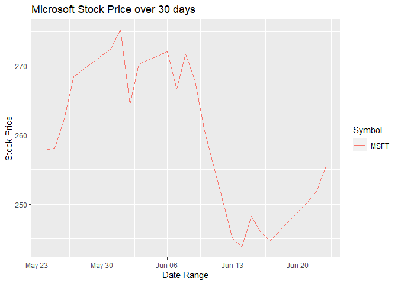<!-- -->

That is quite the drop between June 6th and June 15th. Let’s focus in on
that window

``` r
stockResults2<-stockAggregateLookup(symbolName="MSFT",lookupDateFrom="2022-06-06",lookupDateTo="2022-06-15",multiplier = 1,timespan="day",printSummary=FALSE,returnResultsList=TRUE)

g<-ggplot(data=stockResults2,aes(x=tDate, color=Symbol)) 
  g + geom_line(aes(x=tDate, y=o, color=Symbol)) +
  labs(x="Date Range", y="Stock Price", title="Microsoft Stock Price")
```

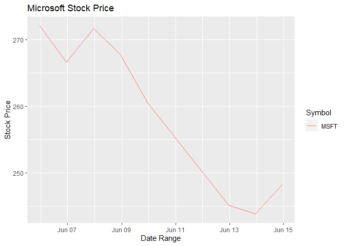<!-- -->

I’m am by no means a financial wizard, but I think you can attribute the
drop to the anticipation of the Federal Reserve raising interest rates
on June 14th. Let see if we can find a similar effect on another stock.
Lets give Amazon a shot.

``` r
stockResults3<-stockAggregateLookup(symbolName="AMZN",lookupDateFrom="2022-06-06",lookupDateTo="2022-06-15",multiplier = 1,timespan="day",printSummary=FALSE,returnResultsList=TRUE)

g<-ggplot(data=stockResults3,aes(x=tDate, color=Symbol))
  g + geom_line(aes(x=tDate, y=o, color=Symbol)) +
  labs(x="Date Range", y="Stock Price", title="Amazon Stock Price")
```

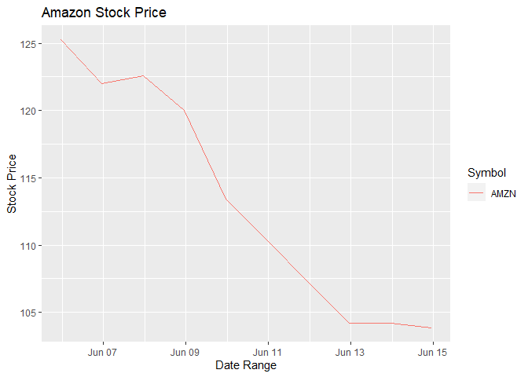<!-- -->

It looks awfully similar to Microsoft. Just for fun, let’s do Apple.

``` r
stockResults4<-stockAggregateLookup(symbolName="AAPL",lookupDateFrom="2022-06-06",lookupDateTo="2022-06-15",multiplier = 1,timespan="day",printSummary=FALSE,returnResultsList=TRUE)

g<-ggplot(data=stockResults4,aes(x=tDate, color=Symbol))
  g + geom_line(aes(x=tDate, y=o, color=Symbol)) +
  labs(x="Date Range", y="Stock Price", title="Apple Stock Price")
```

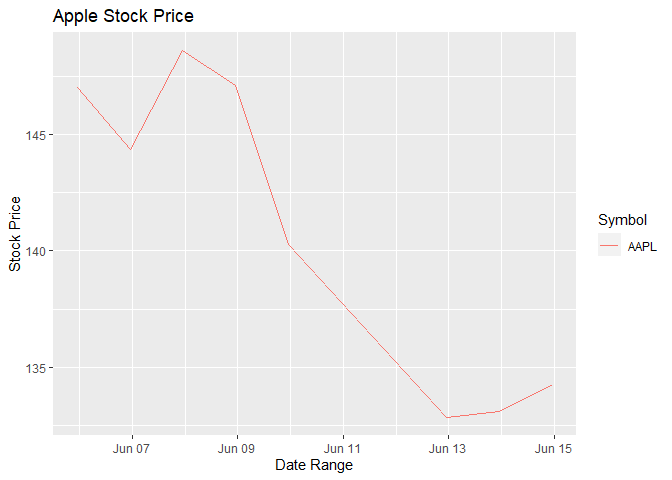<!-- -->

I think it is safe to say there is a pattern going on here. Let’s plot
all three at one and compare.

Wait, we have the data for the three companies stored in three different
data frames. Let’s see if we can join them together to make plotting
easier.

``` r
stockResultsAll<-full_join(stockResults2,stockResults3)
stockResultsAll<-full_join(stockResultsAll,stockResults4)
stockResultsAll
```

    ##            v       vw       o      c        h      l            t       n               tDate Symbol
    ## 1   22397042 270.0763 272.060 268.75 274.1800 267.22 1.654488e+12  260013 2022-06-05 23:00:00   MSFT
    ## 2   22860677 270.6967 266.635 272.50 273.1300 265.94 1.654574e+12  247047 2022-06-06 23:00:00   MSFT
    ## 3   17372341 271.1519 271.710 270.41 273.0000 269.61 1.654661e+12  234208 2022-06-07 23:00:00   MSFT
    ## 4   26439728 268.0203 267.780 264.79 272.7081 264.63 1.654747e+12  301845 2022-06-08 23:00:00   MSFT
    ## 5   31445841 254.9867 260.580 252.99 260.5800 252.53 1.654834e+12  459375 2022-06-09 23:00:00   MSFT
    ## 6   45913188 244.2909 245.110 242.26 249.0242 241.53 1.655093e+12  587062 2022-06-12 23:00:00   MSFT
    ## 7   28651487 243.7922 243.860 244.49 245.7400 241.51 1.655179e+12  370359 2022-06-13 23:00:00   MSFT
    ## 8   33111729 250.6363 248.310 251.76 255.3000 246.42 1.655266e+12  410433 2022-06-14 23:00:00   MSFT
    ## 9  135269024 125.9399 125.245 124.79 128.9900 123.81 1.654488e+12 1740186 2022-06-05 23:00:00   AMZN
    ## 10  85156712 122.3120 122.005 123.00 124.1000 120.63 1.654574e+12  856013 2022-06-06 23:00:00   AMZN
    ## 11  64926594 121.9755 122.610 121.18 123.7500 120.75 1.654661e+12  599425 2022-06-07 23:00:00   AMZN
    ## 12  66997342 118.8313 119.990 116.15 121.3000 116.10 1.654747e+12  650556 2022-06-08 23:00:00   AMZN
    ## 13  87390505 110.4847 113.415 109.65 114.5000 109.05 1.654834e+12  882204 2022-06-09 23:00:00   AMZN
    ## 14  99277742 103.9449 104.190 103.67 106.5400 101.86 1.655093e+12  872871 2022-06-12 23:00:00   AMZN
    ## 15  69728761 103.0364 104.190 102.31 104.8800 101.43 1.655179e+12  628765 2022-06-13 23:00:00   AMZN
    ## 16  85011060 106.2456 103.860 107.67 109.0600 103.53 1.655266e+12  692699 2022-06-14 23:00:00   AMZN
    ## 17  71598380 146.6167 147.030 146.14 148.5689 144.90 1.654488e+12  605199 2022-06-05 23:00:00   AAPL
    ## 18  67808150 147.5529 144.345 148.71 149.0000 144.10 1.654574e+12  527360 2022-06-06 23:00:00   AAPL
    ## 19  53950201 148.6118 148.580 147.96 149.8697 147.46 1.654661e+12  430174 2022-06-07 23:00:00   AAPL
    ## 20  69472976 145.3266 147.080 142.64 147.9500 142.53 1.654747e+12  558178 2022-06-08 23:00:00   AAPL
    ## 21  91566637 138.1785 140.280 137.13 140.7600 137.06 1.654834e+12  826197 2022-06-09 23:00:00   AAPL
    ## 22 122128099 133.1280 132.870 131.88 135.2000 131.44 1.655093e+12 1019929 2022-06-12 23:00:00   AAPL
    ## 23  84784326 132.5738 133.130 132.76 133.8900 131.48 1.655179e+12  674981 2022-06-13 23:00:00   AAPL
    ## 24  91532972 134.6250 134.290 135.43 137.3400 132.16 1.655266e+12  733275 2022-06-14 23:00:00   AAPL
    ##                                    Name
    ## 1  Microsoft Corporation - Common Stock
    ## 2  Microsoft Corporation - Common Stock
    ## 3  Microsoft Corporation - Common Stock
    ## 4  Microsoft Corporation - Common Stock
    ## 5  Microsoft Corporation - Common Stock
    ## 6  Microsoft Corporation - Common Stock
    ## 7  Microsoft Corporation - Common Stock
    ## 8  Microsoft Corporation - Common Stock
    ## 9       Amazon.com, Inc. - Common Stock
    ## 10      Amazon.com, Inc. - Common Stock
    ## 11      Amazon.com, Inc. - Common Stock
    ## 12      Amazon.com, Inc. - Common Stock
    ## 13      Amazon.com, Inc. - Common Stock
    ## 14      Amazon.com, Inc. - Common Stock
    ## 15      Amazon.com, Inc. - Common Stock
    ## 16      Amazon.com, Inc. - Common Stock
    ## 17            Apple Inc. - Common Stock
    ## 18            Apple Inc. - Common Stock
    ## 19            Apple Inc. - Common Stock
    ## 20            Apple Inc. - Common Stock
    ## 21            Apple Inc. - Common Stock
    ## 22            Apple Inc. - Common Stock
    ## 23            Apple Inc. - Common Stock
    ## 24            Apple Inc. - Common Stock

That was easy. Now lets try and plot all three at once.

``` r
g<-ggplot(data = stockResultsAll,aes(x=tDate, color=Symbol))
  g + geom_line(aes(x=tDate, y=o, color=Symbol)) +
  labs(x="Date Range", y="Stock Price", title="Stock Price Compare")
```

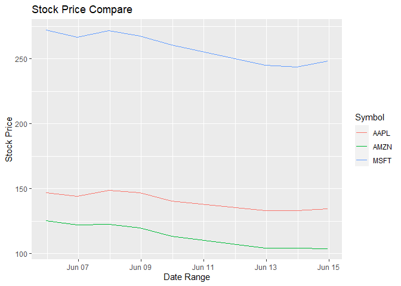<!-- -->

That wasn’t quite as dramatic as I hopped. I think the Microsoft price
is distorting the results a bit. Let’s try it again without Microsoft.

``` r
g<-ggplot(data = filter(stockResultsAll %>% filter(Symbol!="MSFT"), Symbol == "AAPL" || Symbol == "AMZN"),
  aes(x=tDate, color=Symbol)) 
  g + geom_line(aes(x=tDate, y=o, color=Symbol)) +
  labs(x="Date Range", y="Stock Price", title="Stock Price Compare")
```

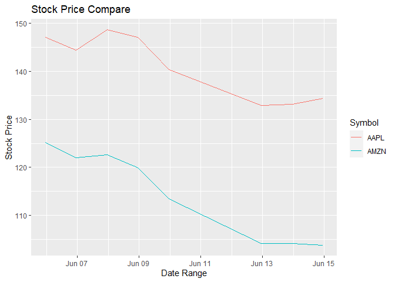<!-- -->

Contingency Tables

One stat you might want to know is how may times the stock has closed
above the opening price - ie. how may days the stock went up in value.
Lets build a quick contingency table to check. In the table below, the
‘TRUE’ column means the stock price went up and the ‘FALSE’ column means
the stock price went down.

``` r
table(stockResultsAll$Symbol,stockResultsAll$c>stockResultsAll$o)
```

    ##       
    ##        FALSE TRUE
    ##   AAPL     6    2
    ##   AMZN     6    2
    ##   MSFT     5    3

Using eight days probably isn’t that helpful. Let’s go back a full year
and try again.

``` r
#Get a full year's worth of data from our 3 stocks
stockResultsMSFT365<-stockAggregateLookup(symbolName="MSFT",lookupDateFrom=Sys.Date()-365,lookupDateTo=Sys.Date()-1,multiplier = 1,timespan="day",printSummary=FALSE,returnResultsList=TRUE)
stockResultsAMZN365<-stockAggregateLookup(symbolName="AMZN",lookupDateFrom=Sys.Date()-365,lookupDateTo=Sys.Date()-1,multiplier = 1,timespan="day",printSummary=FALSE,returnResultsList=TRUE)
stockResultsAAPL365<-stockAggregateLookup(symbolName="AAPL",lookupDateFrom=Sys.Date()-365,lookupDateTo=Sys.Date()-1,multiplier = 1,timespan="day",printSummary=FALSE,returnResultsList=TRUE)
```

Looking at a full year is interesting. The number of days the stock
closes higher is relatively close to the number of days that stock
closed lower. Looking at Amazon, I would suggest staying away from there
stock for a while!

``` r
#Combine the results and display the table
stockResults365All<-full_join(stockResultsMSFT365,stockResultsAMZN365)
stockResults365All<-full_join(stockResults365All,stockResultsAAPL365)

table(stockResults365All$Symbol,stockResults365All$c>stockResults365All$o)
```

    ##       
    ##        FALSE TRUE
    ##   AAPL   119  133
    ##   AMZN   138  114
    ##   MSFT   122  130

Numerical Summaries

Lets go back to the more recent history around the federal rate hike to
gain additional insights there. We can dig a bit deeper and compare the
three companies and their closing prices. If we build a table grouped by
stock symbol, we can see the summary stats for each company. Looking at
the output below, you can see that Microsoft had by far the largest
variance. Meaning they were likely most impacted by the rate hike.

``` r
stockResultsAll %>% group_by(Symbol) %>%
summarise(avg = mean(c), med = median(c), var = var(c), min=min(c), max=max(c))
```

    ## # A tibble: 3 × 6
    ##   Symbol   avg   med   var   min   max
    ##   <chr>  <dbl> <dbl> <dbl> <dbl> <dbl>
    ## 1 AAPL    140.  140.  47.2  132.  149.
    ## 2 AMZN    114.  113.  79.2  102.  125.
    ## 3 MSFT    258.  259. 145.   242.  272.

Another thing to look at is the trade volume. Below you can see that
Apple and Amazon were far more active in terms of trade value than
Microsoft. This might have prevented the two stocks from dropping as
much as Microsoft did.

``` r
stockResultsAll %>% group_by(Symbol) %>%
summarise(avg = mean(v), med = median(v), var = var(v), min=min(v), max=max(v))
```

    ## # A tibble: 3 × 6
    ##   Symbol       avg       med     var      min       max
    ##   <chr>      <dbl>     <dbl>   <dbl>    <dbl>     <dbl>
    ## 1 AAPL   81605218. 78191353  4.36e14 53950201 122128099
    ## 2 AMZN   86719718. 85083886  5.25e14 64926594 135269024
    ## 3 MSFT   28524004. 27545608. 7.58e13 17372341  45913188

Tables are net, but lets get back to plotting. Here is the same volume
information, but in box plot form. Looking at the wisker size, you can
see that Apple had more extreme amounts of volume where-as the volume
for Microsoft and Amazon was largely consistent. Interesting though that
Microsoft and Amazon are showing a couple outliers with Amazon having
what appears to be and extremely high volume outlier.

``` r
g <- ggplot(stockResultsAll, aes(x = Symbol, y = v))
g + geom_boxplot(fill = "grey") + coord_flip() +
  labs(x="Volume", y="Stock Type", title="Stock Volume Analysis")
```

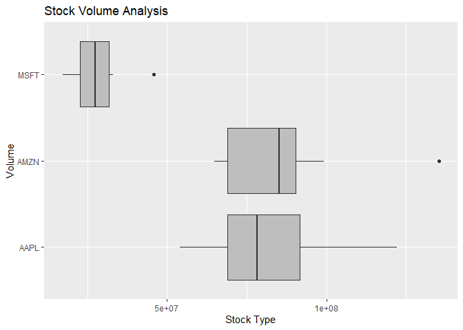<!-- -->

Let’s try a scatterplot to see if we can figure out when that extremly
high trade volume for Amazon occurred. Interesting enough, it looks like
the high volume occurred before the fed rate hike. All stocks had a
noticable gain in volume the day before the rate hike. This is further
evidence that traders were expecting the price to take a hit and likely
sold before the stock hit bottom.

``` r
g<-ggplot(stockResultsAll, aes(x=tDate, y=v, color=Symbol))
  g + geom_point(size=3, shape=10) +
  labs(x="Date", y="Volume", title="Stock Volume Analysis")
```

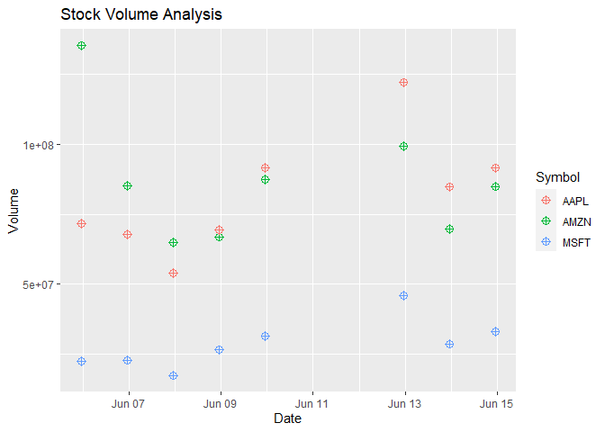<!-- -->

A scatter plot might not be the best view given the data. Let’s try a
side-by-side bar chart instead.

``` r
sumData <- stockResultsAll %>% group_by(Symbol,tDate) 
  g2 <- ggplot(sumData, aes(x = tDate, y = v))
  #position=dodge for side-by-side plots
  g2 + geom_bar(aes(fill = as.factor(Symbol)), stat = "identity", position="dodge") +
    labs(x="Volume", y="Volume", title="Stock Volume Analysis") +
    scale_fill_discrete(name = "Symbol")
```

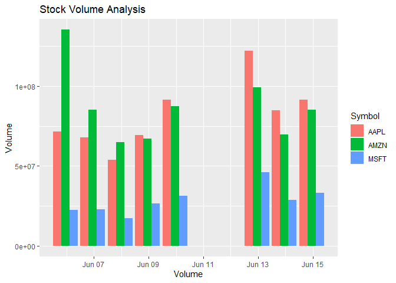<!-- -->

Lets see if we can spot a long term trend pricing average. Start with a
histogram of Microsoft’s closing price over the last 30 days. It’s hard
to spot a clear average here. Let’s get some additional observations.

``` r
g<-ggplot(data=stockResults1,aes(x=c))
  g + geom_histogram(bins=10, fill="blue") +
  labs(x="Stock Price", y="Count", title="Microsoft Stock Price - 30 Days")
```

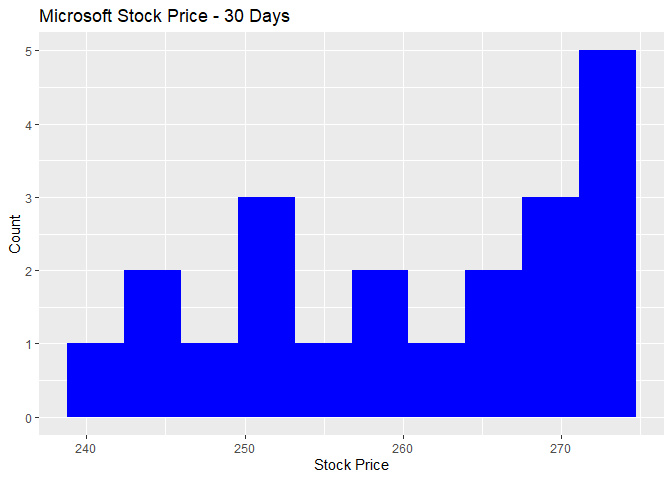<!-- -->

Here we are graphing the results from the last 120 days. It looks like
the closing average is starting to center around the $280 price point.
Lets try one more with additional observations.

``` r
stockResults5<-stockAggregateLookup(symbolName="MSFT",lookupDateFrom=Sys.Date()-120,lookupDateTo=Sys.Date()-1,multiplier = 1,timespan="day",printSummary=FALSE,returnResultsList=TRUE)

g<-ggplot(data=stockResults5,aes(x=c))
  g + geom_histogram(bins=30, fill="blue") +
  labs(x="Stock Price", y="Count", title="Microsoft Stock Price - 120 Days")
```

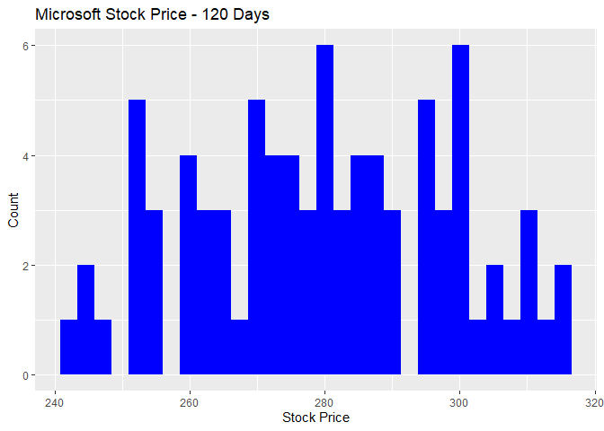<!-- -->

Here we are graphing the results from the last 365 days. The closing
average is definitely centered around the $280 price point with a higher
upside. Looks like now (06/19/2022) would be a good time to buy some
stock!

``` r
stockResults5<-stockAggregateLookup(symbolName="MSFT",lookupDateFrom=Sys.Date()-365,lookupDateTo=Sys.Date()-1,multiplier = 1,timespan="day",printSummary=FALSE,returnResultsList=TRUE)

g<-ggplot(data=stockResults5,aes(x=c))
  g + geom_histogram(bins=30, fill="blue") +
  labs(x="Stock Price", y="Count", title="Microsoft Stock Price - 365 Days")
```

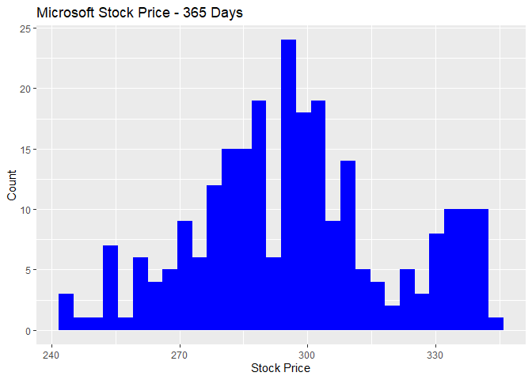<!-- -->
